# React Agent Refactoring

## 🎯 Objetivo

Simplificar la implementación del agente de análisis de contexto utilizando el helper `createReactAgent` de LangGraph, similar al patrón de Python.

## 📚 Comparación con Python

### Python (Original)
```python
from langchain.chat_models import init_chat_model
from langchain_core.tools import tool
from langgraph.prebuilt import create_react_agent
from langgraph.prebuilt.chat_agent_executor import AgentState

SYSTEM_PROMPT = "You are a helpful arithmetic assistant who is an expert at using a calculator."

model = init_chat_model(
    model="gemini-2.5-flash", 
    model_provider="google_genai", 
    temperature=0.0
)
tools = [calculator]

# Create agent
agent = create_react_agent(
    model,
    tools,
    prompt=SYSTEM_PROMPT,
    #state_schema=AgentState,  # default
).with_config({"recursion_limit": 20})
```

### TypeScript (Nuevo)
```typescript
import { createReactAgent } from "@langchain/langgraph/prebuilt";
import { ChatGoogleGenerativeAI } from "@langchain/google-genai";

// Initialize model
const model = new ChatGoogleGenerativeAI({
  model: "gemini-2.5-flash",
  temperature: 0.7,
  apiKey: key,
});

// Define tools
const tools = [
  createContextAnalysisTool(),
  createSearchTool(),
  createDataProcessingTool(),
  // ... MCP tools added automatically
];

// System prompt
const systemPrompt = `You are an expert context analysis assistant...`;

// Create React Agent
const reactAgent = createReactAgent({
  llm: model,
  tools: tools,
  messageModifier: systemPrompt,
  // state_schema defaults to AgentState (messages: BaseMessage[])
}).withConfig({
  recursionLimit: 20,
});

// Execute
const result = await reactAgent.invoke({
  messages: [{ role: 'user', content: userInput }]
});
```

## 🔄 Cambios Principales

### 1. **Imports Simplificados**
```typescript
// Antes: StateGraph manual
import { StateGraph, END, START } from "@langchain/langgraph";

// Ahora: createReactAgent prebuilt
import { createReactAgent } from "@langchain/langgraph/prebuilt";
```

### 2. **Eliminación de Grafo Manual**
**Antes** (300+ líneas de nodos, edges, condiciones):
```typescript
protected buildGraph() {
  const graph = new StateGraph(AgentStateAnnotation);
  
  graph.addNode("reasoning", async (state) => { ... });
  graph.addNode("execute_tools", async (state) => { ... });
  graph.addNode("should_continue", async (state) => { ... });
  graph.addNode("synthesize", async (state) => { ... });
  
  graph.addEdge(START, "reasoning");
  graph.addEdge("reasoning", "execute_tools");
  // ... más edges y condiciones
  
  return graph;
}
```

**Ahora** (simple y directo):
```typescript
protected buildGraph() {
  const systemPrompt = `You are an expert context analysis assistant...`;
  
  this.reactAgent = createReactAgent({
    llm: this.model,
    tools: this.tools,
    messageModifier: systemPrompt,
  }).withConfig({
    recursionLimit: this.config.maxIterations || 20,
  });
  
  // Retornar StateGraph dummy para mantener compatibilidad con BaseAgent
  return new StateGraph(AgentStateAnnotation);
}
```

### 3. **Método run() Sobrescrito**
```typescript
async run(input: string | any[]): Promise<any> {
  const messages = typeof input === 'string' 
    ? [{ role: 'user', content: input }]
    : input;

  const initialState = { messages };
  
  // Invocar directamente el agente React (ya compilado)
  const result = await this.reactAgent!.invoke(initialState);
  
  return {
    success: true,
    data: result,
    messages: result.messages,
  };
}
```

## ✅ Beneficios

### 1. **Código Más Simple**
- **Antes**: ~450 líneas con lógica compleja de nodos y edges
- **Ahora**: ~240 líneas, enfocado en configuración y herramientas

### 2. **Mantenibilidad**
- Menos código personalizado = menos bugs
- Usa implementación probada y optimizada de LangGraph
- Más fácil actualizar a nuevas versiones

### 3. **Mejor Alineación con Patrones Estándar**
- Sigue el mismo patrón que Python y otros lenguajes
- Documentación y ejemplos directamente aplicables
- Comunidad más amplia de usuarios

### 4. **React Pattern Automático**
El agente ahora sigue automáticamente el patrón ReAct:
1. **Reason**: Analiza la solicitud y decide qué hacer
2. **Act**: Ejecuta herramientas según sea necesario
3. **Observe**: Procesa resultados de herramientas
4. **Repeat**: Itera hasta completar la tarea o alcanzar límite

## 🔧 Configuración

### Opciones Disponibles

```typescript
const config: AgentConfig = {
  name: "ContextAnalyzer",
  description: "Specialized agent for context analysis",
  model: "gemini-2.5-flash",
  temperature: 0.7,
  maxIterations: 20,  // Usado como recursionLimit
  tools: [
    { name: "analyze_context", enabled: true },
    { name: "search_information", enabled: true },
    { name: "process_data", enabled: true },
  ],
  mcpServers: [
    {
      type: 'http',
      url: 'http://localhost:3001/sse',
    },
  ],
  verbose: true,
};
```

### Inicialización

```typescript
// 1. Crear agente
const agent = new ContextAnalyzerAgent(config);

// 2. Inicializar modelo
agent.initializeModel(process.env.GOOGLE_API_KEY);

// 3. Inicializar (conecta MCP servers, carga tools, construye grafo)
await agent.initialize();

// 4. Ejecutar
const result = await agent.run("Analyze this context...");
```

## 🎨 Personalización del System Prompt

El system prompt define el comportamiento del agente:

```typescript
const systemPrompt = `You are an expert context analysis assistant. Your role is to:

1. **Analyze Context**: Examine and understand the context provided by the user in depth
2. **Search Information**: Find additional relevant information when needed
3. **Process Data**: Structure and organize data in a meaningful way
4. **Web Browsing**: Navigate and extract information from web pages when URLs are provided

You have access to specialized tools to help you complete these tasks. Use them wisely based on the user's request.

Be thorough, precise, and provide detailed insights in your analysis.`;
```

## 🛠️ Herramientas

### Herramientas Simuladas
Definidas en `tools/simulated-tools.ts`:
- `analyze_context`: Análisis de contexto
- `search_information`: Búsqueda de información
- `process_data`: Procesamiento de datos

### Herramientas MCP (Playwright)
Agregadas automáticamente desde servidor MCP:
- `browser_navigate`: Navegar a URL
- `browser_snapshot`: Capturar snapshot de página
- `browser_click`: Click en elementos
- `browser_type`: Escribir texto
- Y más...

## 📊 Estado del Agente

El estado por defecto es simple y directo:

```typescript
interface AgentState {
  messages: BaseMessage[];
}
```

Este es el mismo esquema que usa Python por defecto (`AgentState`).

## 🔄 Flujo de Ejecución

```mermaid
graph TD
    A[Usuario: Solicitud] --> B[reactAgent.invoke]
    B --> C{ReAct Loop}
    C --> D[Reason: Analizar tarea]
    D --> E[Act: Ejecutar herramientas]
    E --> F[Observe: Procesar resultados]
    F --> G{¿Completado?}
    G -->|No| C
    G -->|Sí| H[Return: Respuesta final]
    H --> I[Usuario: Resultado]
```



## 🚀 Ejemplo de Uso

```typescript
import { ContextAnalyzerAgent } from './agents/implementations/context-analyzer-agent';

async function main() {
  // Crear y configurar agente
  const agent = new ContextAnalyzerAgent({
    verbose: true,
    maxIterations: 15,
  });
  
  // Inicializar
  agent.initializeModel(process.env.GOOGLE_API_KEY);
  await agent.initialize();
  
  // Ejecutar análisis simple
  const result1 = await agent.run("Analyze the current market trends in AI");
  console.log(result1);
  
  // Ejecutar con URL para navegación web
  const result2 = await agent.run("What's on https://example.com?");
  console.log(result2);
  
  // Limpiar
  await agent.cleanup();
}

main();
```

## 📝 Notas Importantes

1. **Compatibilidad con BaseAgent**: 
   - El método `buildGraph()` retorna un `StateGraph` dummy para mantener compatibilidad
   - El agente real se almacena en `this.reactAgent`
   - El método `run()` está sobrescrito para usar `reactAgent` directamente

2. **Límite de Recursión**:
   - Controlado por `maxIterations` en config
   - Previene loops infinitos
   - Valor recomendado: 15-20

3. **Herramientas MCP**:
   - Se agregan automáticamente en `initialize()`
   - El agente decide cuándo y cómo usarlas
   - No requiere lógica manual de detección

4. **Verbose Logging**:
   - Habilitar con `verbose: true` en config
   - Útil para debugging y entender el flujo
   - Muestra decisiones del agente y ejecución de herramientas

## 🔍 Debugging

Para ver el grafo interno del agente React:

```typescript
// Después de initialize()
const graph = agent['reactAgent'];
const graphImage = await graph.getGraph().drawMermaid();
console.log(graphImage);
```

## 📚 Referencias

- [LangGraph ReAct Agent](https://langchain-ai.github.io/langgraphjs/how-tos/create-react-agent/)
- [Google Gemini with LangChain](https://js.langchain.com/docs/integrations/chat/google_generativeai)
- [MCP Integration](./MCP_HTTP_CONNECTIONS.md)
- [Agent Architecture](./AGENTS_ARCHITECTURE.md)
